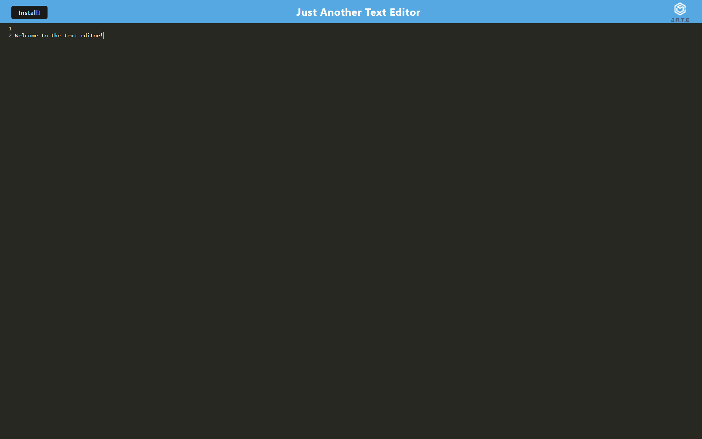

# Text Editor (J.A.T.E. Just Another Text Editor)

<!-- Visit the [Text Editor](https://kdelaria-text-editor-90cd26e67332.herokuapp.com/) webpage. -->

## Description

 This website was designed to store notes.

## Installation

Click the **Install** button, then click **Install** on the popup prompt.

## Usage

Click inside of the text area and start typing to add text.  Click the **Install** button

## Credits

Thanks to my instructor Gary for providing starter code.

*"Progressive Web Apps in 100 Seconds // Build a PWA from Scratch" Fireship, YouTube, *[https://www.youtube.com/watch?v=sFsRylCQblw](https://www.youtube.com/watch?v=sFsRylCQblw)*. Accessed 24 Feb. 2024.*

*"Strategies for service worker caching" Chrome For Developers, *[developer.chrome.com/docs/workbox/caching-strategies-overview](https://developer.chrome.com/docs/workbox/caching-strategies-overview/)*. Accessed 24 Feb. 2024.*

*"Caching | Webpack" Kooilinc,  Webpack, *[webpack.js.org/guides/caching](https://webpack.js.org/guides/caching/)*. Accessed 24 Feb. 2024.*

## License
N/A
